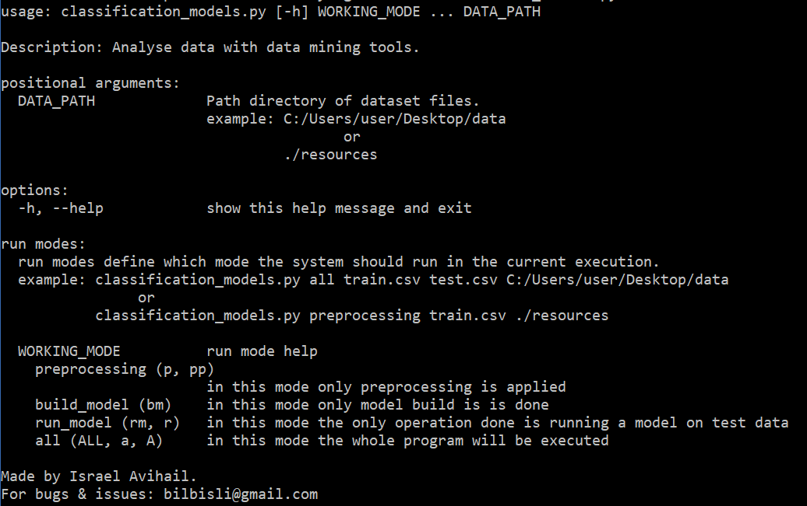
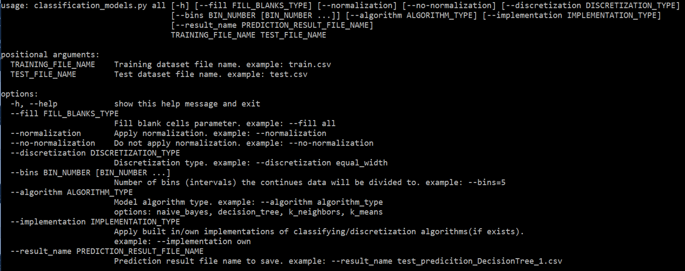
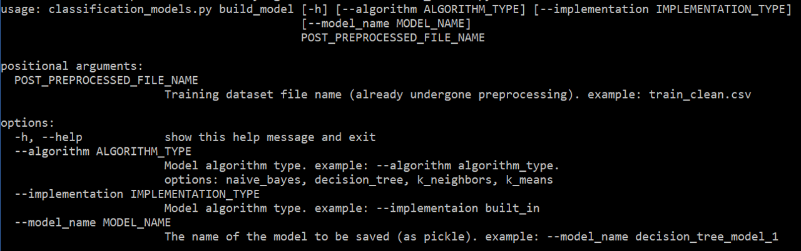
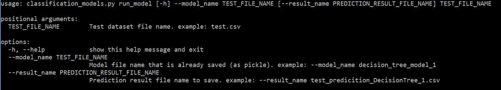
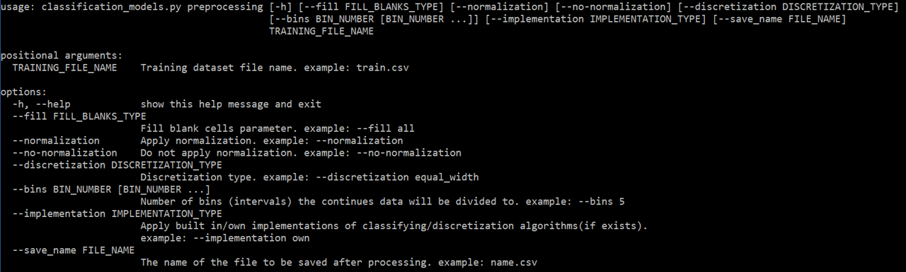

# ClassificationModels
Analyse data with data mining tools using this program
### Author:
Israel Avihail	
## Project UML
[project UML](https://github.com/bilbisli/ClassificationModels/blob/master/project%20UML.pdf)
## Required libraries:
### imports of file data_analysis
 - argparse:
used to provide and parse the command line interface
 - os:
os.path.exists Used to check if the path exists, if it doesn't exist we use os.mkdir to create it
 - pickle:
serializes objects so they can be saved to a file and loaded again later on
 - Sequence:
used to check if an object is a Sequence
 - numpy:
numpy is a Python library used for working with arrays
- pandas:
uesd to read csv files and commit operations on it, Intervals is used to check if an object is the same type, pd.IntervalIndex use to convert to interval
 - stats:
we import scipy.stats to use the entropy function which represents the effective size index of probability space
 - sklearn:
Kmeans, GaussianNB, CategoricalNB, KNeighborsClassifier, StandardScaler:  used for calculation and generation of Confusion Matrix PDFs
### imports of file Classifier_Algorithm
 - abc:
this module provides the infrastructure for defining abstract base classes (ABCs) in Python, we used to do interface

### imports of file dictionary_tree

 - copy:
import copy to use for deep copy

 - convert_to_list:
this function converts given data to a list

### imports of file entropy

 - Fraction:
used to convert two numbers (numerator and denominator) to a rational number, we used it to check if an object is a fraction and to work with fractons for precision purposes
 - log2:
used to calculate entropy

### imports of file entropy_discretization

- combinations:
used to return r-length tuple combinations in sorted order with no repeated elements, we used it in entropy to generate indexes for various cuts of the data up until cuts in the size of the desired bins (to calculate the entropy of the different cuts) 

## How to add custom classification algorithm:
	1. step 1: add the algorithem to package/folder of "classification_algorithms" within the project
	2. step 2: in the package/folder "classification_algorithms" within the "__init__.py" file:
		 2.1. import the new algorithm (class). example: "from classification_algorithms.algorithm_file import AlgorithmName"
		 2.2. add the algorithm (class) to "__algorithm__" list. example: "[AlgorithmName, <existing algorithms...>]"
*It is recommended that the classification algorithm will implement the classification algorithm interface "ClassifierAlgorithm" which is located in "project_util" package/folder. </br>
example: </br>
	```from project_util.classifier_algorithm import ClassifierAlgorithm``` </br>
	```class AlgorithmName(ClassifierAlgorithm):```
  
## Preparing and running within a Virtual Enviroment:

##### -- option 1 --
	1. step 1: create a virtual enviroment (python must be installed before hand)
		1.1. open a shell within the project folder ("ClassifyingModels")
		1.1.1. on Windows run the command:  ```py -m venv env```
		1.1.2. on Unix/MacOs run the command: ```python3 -m venv env```
	2. step 2: activate the enviroment
		2.1. on Windows run the command: ```.\env\Scripts\activate```
		2.2. on Unix/MacOs run the command: ```source env/bin/activate```
	3. step 3: install requirements
		3.1. on Windows run the command: ```py -m pip install -r requirements.txt```
		3.2. on Unix/MacOs run the command: ```python3 -m pip install -r requirements.txt```
	
##### -- option 2 --
	1. on Windows run the bat file within the project folder: ```run_windows.bat```
	2. on Unix/MacOs (or Windows with supporting shell such as git) run the sh file withing the project folder: ```run_unix_mac.sh```

When the enviroment is all set, the program can now be run.

#### Important!!
After either options, when work with the program is finished, the enviroment needs to be deactivated:</br>
	- In the active enviroment's open shell run the command: ```deactivate```
	
## How to Run :
#### Command help section - To see this text (the help section) via the program  - run the command (in the open shell):<br/> ```classification_models.py -h```



#### Run Mode help section (example for 'all') - To see this text (the help section) via the program - run the command (in the open shell): ```classification_models.py a -h```



#### Build Model help section - To see this text (the help section) via the program - run the command (in the open shell):<br/> ```classification_models.py bm -h```



#### Run Model help section - To see this text (the help section) via the program - run the command (in the open shell):<br/> ```classification_models.py rm -h```



#### Run Preprocessing help section - To see this text (the help section) via the program - run the command (in the open shell):<br/> ```classification_models.py pp -h```


